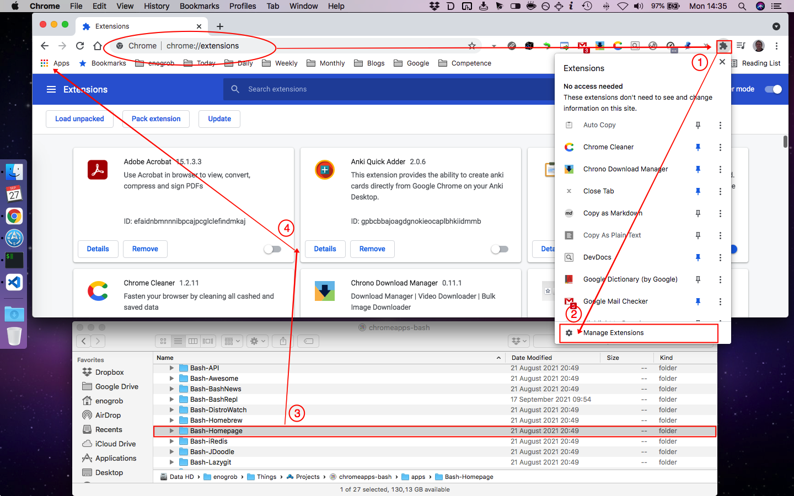
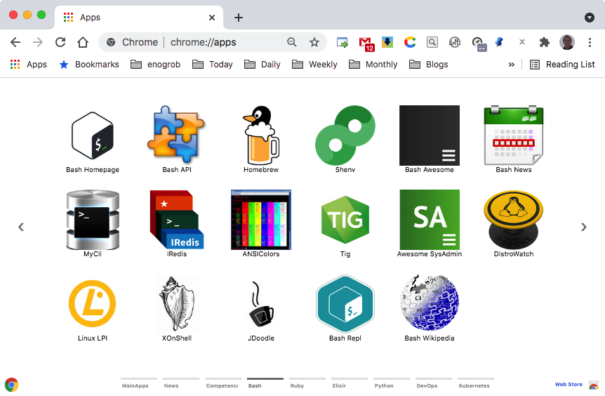

# Chrome Apps for Bash

Gather Bash important references and shortcuts in form of Chrome Apps.


## Installation

### 1. Clone this repository and see its contents.
Open a terminal give the following command:

```bash
$ git clone https://github.com/enogrob/chromeapps-bash.git
$ cd chromeapps-bash
```

As we can see a subdirectory is created for each Bash app.

```bash
$ ls -la
total 984
drwxr-xr-x@  10 enogrob  staff    340 Oct  3 16:42 .
drwxr-xr-x@ 298 enogrob  staff  10132 Oct  4 02:29 ..
-rw-r--r--@   1 enogrob  staff   6148 Oct  3 16:58 .DS_Store
drwxr-xr-x   14 enogrob  staff    476 Oct  3 16:54 .git
-rw-r--r--    1 enogrob  staff      5 May 31  2016 .gitignore
drwxr-xr-x   10 enogrob  staff    340 Nov 17  2016 .idea
-rw-r--r--@   1 enogrob  staff      0 Nov 17  2016 Icon?
-rw-r--r--@   1 enogrob  staff   1892 Oct  4 02:33 README.md
drwxr-xr-x   19 enogrob  staff    646 Oct  4 02:31 apps
drwxr-xr-x    4 enogrob  staff    136 Oct  4 02:32 images

$ tree -L 1 apps/
apps
├── Bash-3llo
├── Bash-ANSI
├── Bash-ANSIColors
├── Bash-API
├── Bash-Awesome
├── Bash-BashNews
├── Bash-BashRepl
├── Bash-DistroWatch
├── Bash-Homebrew
├── Bash-Homepage
├── Bash-iRedis
├── Bash-JDoodle
├── Bash-Lazygit
├── Bash-LinuxLPI
├── Bash-MyCli
├── Bash-PV
├── Bash-Shenv
├── Bash-SysAdmin
├── Bash-Tig
├── Bash-Webminal
├── Bash-Weekly
├── Bash-Wikipedia
└── Bash-XonShell

23 directories, 0 files

# in order to open Files in "Linux" to drag the App folders if wanted.
$ cd apps
$ xdg-open .&
```

### 2. Open Chrome with the following url:
In order to load the `Chrome Apps` for Bash, check `Developer Mode` and press `Load unpacked extension...` to load each App selecting its corresponding directory inside `apps` e.g. `Bash-Homepage`, and then repeat that for the wanted apps. 


Or just drag and drop the app folder on the [Extensions page](chrome://extensions).



### 3. After load the Chrome Apps wanted for Bash, Chrome will look like the screenshot below:



Pressione the Chrome "Apps" button and then look for the ones you have inserted. You can drag as you want in order to put them in desired order.
